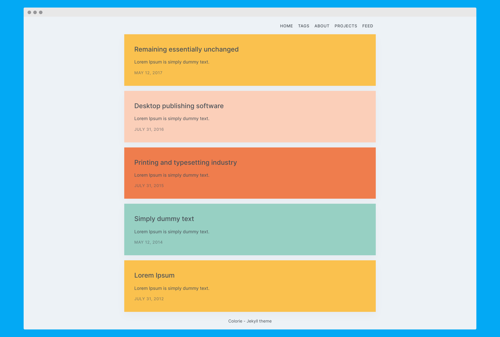

## Colorie - Single column blog and portfolio Jekyll theme 

Colorful, minimal one-column portfolio/blog theme built for Jekyll. Perfect for your personal website, blog and portfolio.

### Key features

- seo optimized
- portfolio/blog/tag pages
- AAA, 100/100 scores on Lighthouse, Gmetrix and Webpagetest
- responsive
- inline css
- dusqus comments
- compressed css, html
- sitemap
- robots.txt
- atom feed
- json feed
- http security headers

